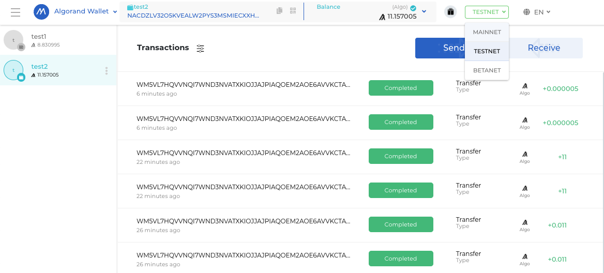
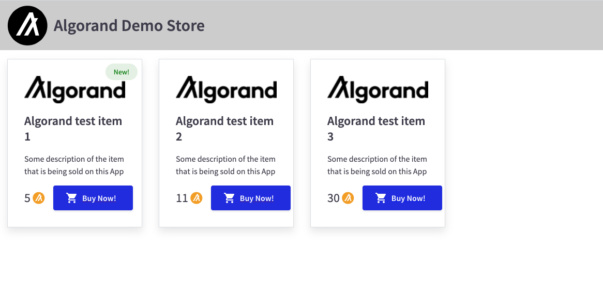
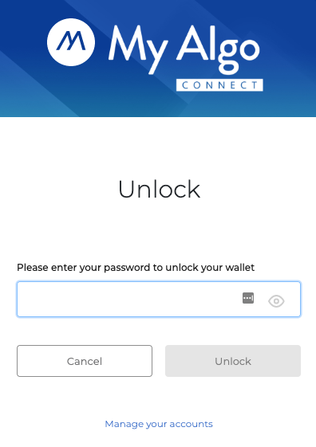
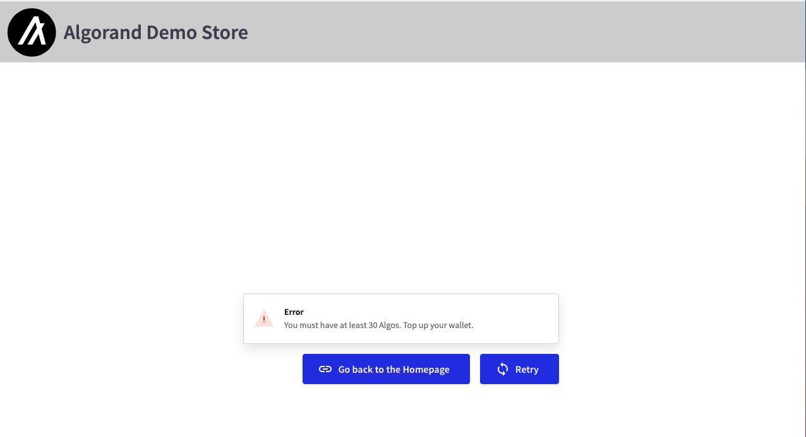
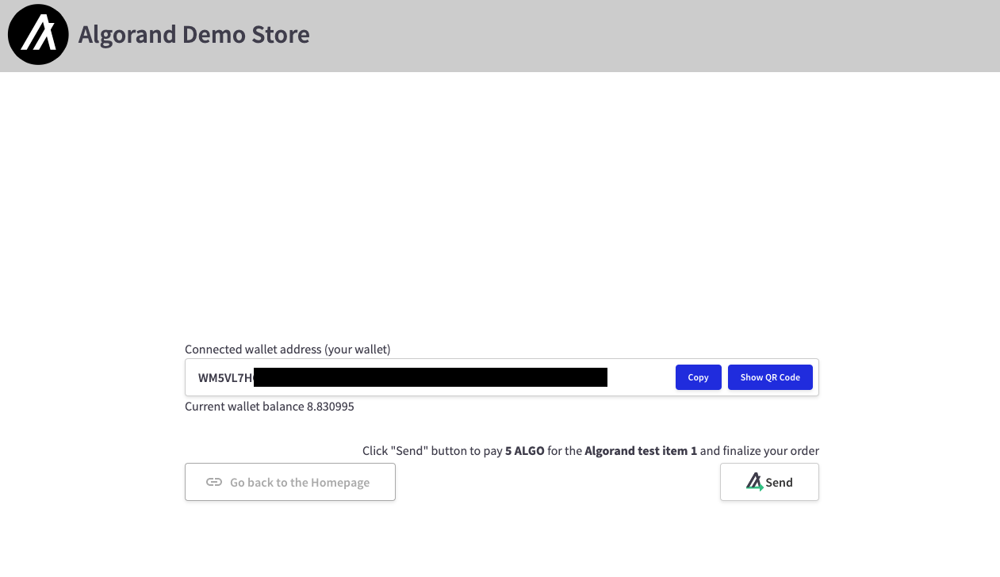

# Restricted Algorand checkout form based on the Pipeline UI library

The user can proceed to the checkout form only if he has enough ALGO in his wallet to pay for the selected "item".

> Disclaimer
>
> This is not a production ready code, it's just a Pipeline UI library usage example.
> There are many edge cases and potential issues that are not properly handled.

## Prerequisites - Algorand Wallet

In order to see how this application works you will need an Algorand Wallet.
If you don't have one right now go to https://wallet.myalgo.com/ and click "Access Now" button.
It will walk you through the process of a new wallet creation, it is completely free.

As you probably don't want to use MAINNET for testing purposes you should now head to https://bank.testnet.algorand.network/ to create some ALGO on your account on the TESTNET (also for free).
In order to manage your TESTNET assets you have to switch to the TESTNET, check the screenshot below.

It is also a good idea to create more than one address so you can test ALGO sending through the app.

## Check the online version

Visit https://johnmgrimm.github.io/algorand-restricted-checkout to see the app that is working with the ALGO TESTNET.
If you make any payment it will use my TESTNET wallet as a recipient address.

## Running locally

Clone the project with `git clone https://github.com/johnmgrimm/algorand-restricted-checkout.git`.

Put one of your ALGO wallet addresses inside `./env` file as `REACT_APP_RECIPIENT_ADDRESS`. This will be the address that will receive ALGOs.

Right now everything is set and you can execute `yarn start` command.
By default you should be able to see the results by opening http://localhost:3000/algorand-restricted-checkout/.

## Using the application

Clicking "Buy Now!" button will redirect you to the checkout page for the selected item where the popup window will ask you to unlock your Algorand wallet.
If you have more than one address use the one that is not linked with the application through the `./env` file.

After you will unlock the wallet the application will check your ALGO balance.
In case you don't have enough ALGO on your wallet to pay for the selected "item" you will not be able to see the checkout page.

With enough ALGO you should be able to finish your order and send ALGO to pay for the "item".

Afer saving the transaction to the blockchain application should show the "Payment sent" message with the transaction ID and "Go back to the Homepage" button.

## Configuration .env file

Main settings are gathered inside [`./env`](./.env) file:

- `REACT_APP_RECIPIENT_ADDRESS` - address that will receive all ALGO transfers
- `REACT_APP_USE_TESTNET` - toggle that allows to switch to the ALGO mainnet (NOT RECOMMENDED)

## Configuration items list

All the items available in the application are loaded from a JSON file [`items.json`](./src/data/items.json) placed inside `/src/data/` directory.
The main modification that will affect the application is the `price` as user will not be able to see the checkout form if he doesn't have enough ALGO in his wallet to pay for the selected item.

## Technical details

Application is created with the Create React App.

It is written in Typescript using React Functional Components and React Hooks approach wherever possible which is the current state of the art.

Besides `pipeline-ui` library `react-use` and `react-router-dom` are used.

To keep code well formatted `prettier` package is declared as devDependency.

Because of lack of Typescript definitions for the `pipeline-ui` (as of now) the [`globals.d.ts`](./src/globals.d.ts) file was created.

The entire codebase is inside `./src/app` directory divided by the page on which code is
used (either Home or Checkout).

There is some level of responsiveness built-in to the app to test how it works with the Pipeline UI library (see the Homepage).

## Pipeline UI components used

- Flex, Box, Text - used nearly everywhere as they are base components to build from
- Card, Image, Heading, Pill - used for the "items" presentation
- Loader - used to show loading icon when user logs into the wallet
- ToastMessage - used to notify user about successes and failures when establishing wallet connection
- AlgoSendButton - used to transfer funds from the user account to the account configured in application
- Button - used to navigate across application pages and to trigger actions

## Pipeline UI functions used

- connect - initializes wallet connection
- balance - checking wallet balance

## Pipeline UI library feedback

https://github.com/algorandfoundation/grow-algorand/issues/85#issuecomment-894876646

## LICENSE

[MIT](./LICENSE)

---

author: John Grimm
